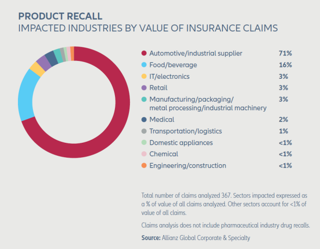

# FinTech application to mass communicate drug recalls, prescription changes and over-the-counter (OTC) medicines for Consumers

### Background

Every year, there are thousands of recalls issued by the Federal Drug Administration. A drug recall occurs when a prescription or over-the-counter medicine is removed from the market because it is found to be either defective or potentially harmful. Sometimes, the makers of the drug will discover a problem with their drug and voluntarily recall it. 

Other times, the FDA will request that the medicine be recalled after receiving reports of problems from the public (WebMD 2022). Once on the market, the FDA, along with the makers of prescription drugs, continue to monitor the medicine for any unforeseen problems (WebMD 2022). Unfortunately, recalls and changes to prescription drugs are often untimely and costly to the consumer which may result in financial difficulties or even death. 

Today as Baby Boomers continue to leave the American workforce, many are faced with the high cost of medical care and prescription drugs with a fixed income. There have already been millions of instances where lower income Americans have been forced to either replenish there medical prescriptions or pay their utilities. The rising costs of prescription drugs and the management of drug recalls impacts many industries across America.

### References

* 79 Fintech Companies & Startups to Keep in Your Back Pocket  https://www.bcbsm.com/content/dam/microsites/medicare/documents/drug-recall-list.pdf
* Fundrise Website                                                     https://www.webmd.com/a-to-z-guides/what-is-a-drug-recall
* CNBC https://www.fda.gov/drugs/drug-safety-and-availability/drug-recalls

* Wikipedia                                                            https://www.slideshare.net/SafeMedicines/a-day-in-the-life-of-illegal-online-drug-sellers-using-social-media-by-tim-mackey-alsberg-fellow
* Crowdfund Insider                                                    https://www.cms.gov/Research-Statistics-Data-and-Systems/Research-Statistics-Data-and-Systems
* Moneycrashers          https://lagunatreatment.com/addiction-research/fda-drug-recalls/
* Moneycrashers          https://www.recallalert.org/
* Moneycrashers          CaryRx | Stoplight
* Moneycrashers          https://www.cbo.gov/data/budget-economic-data
* Moneycrashers          https://data.chhs.ca.gov/dataset/prescription-drug-wholesale-acquisition-cost-wac-increases

### API Sources
* GoodRX          https://www.goodrx.com/developer/documentation
* GoodRX          https://lhncbc.nlm.nih.gov/RxNav/APIs/index.html
* GoodRX          Validates and saves customer payment information to payment processor. | CaryRx Fulfilment API
* GoodRX          https://www.pfizercentreone.com/api-finder
* GoodRX          https://developer.walgreens.com/sites/default/files/v1_RXRefillAPI.html
* GoodRX          https://developers.google.com/earth-engine/apidocs

